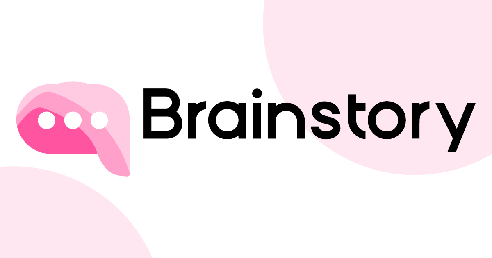
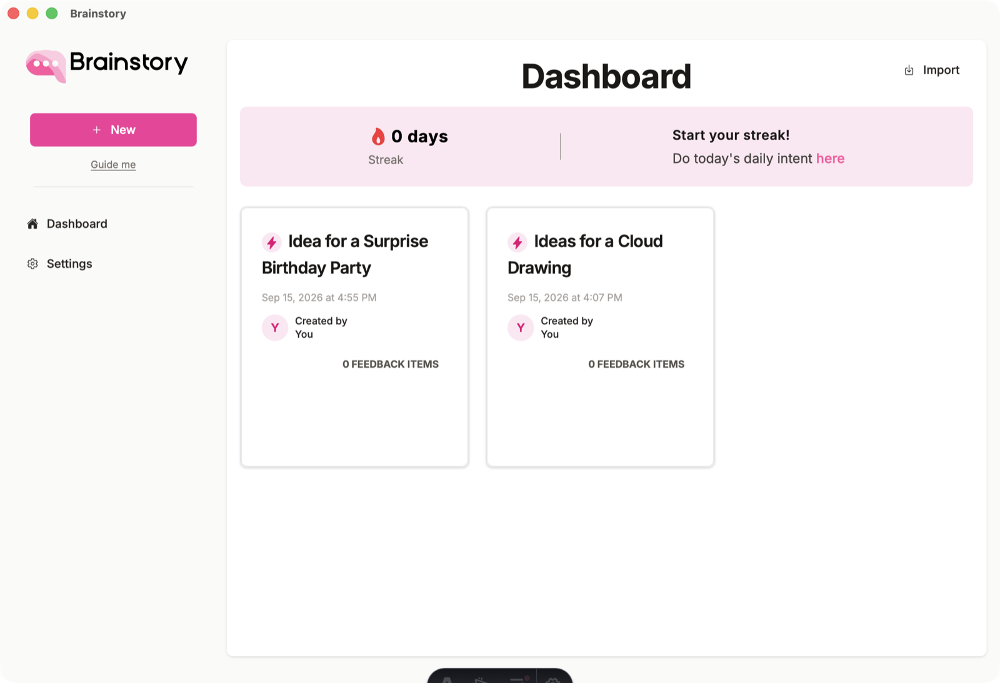

<div align="center">
  
  <p><strong>Think out loud — rebuilt as a local-first desktop app.</strong></p>
  <p>Everything (speech-to-text, the LLM, your ideas, streaks, settings) runs and lives<br/>
  on your machine. No accounts, no servers.</p>
  
</div>

## AI models

First launch (or from **Settings → AI Models**), download:

- **LLM** — Google Gemma 4 E2B (QAT 4-bit GGUF, ~3.3 GB, default), Gemma 4 E4B
  (QAT 4-bit, ~5.2 GB), or MiniCPM5 2B (~1.6 GB) for lighter machines.
  Runs via llama.cpp with Metal acceleration on Apple Silicon.
- **STT** — whisper.cpp tiny.en (~78 MB), base.en (~148 MB, default), small.en
  (~488 MB), or large-v3-turbo (~1.6 GB).

Downloads are verified against pinned file sizes and SHA-256 hashes before
being activated, so a truncated or corrupted transfer can't brick a model slot.
Downloads can be cancelled from the same card; a hard quit leaves no garbage
behind (partial `.part` files are swept at the next launch). Switching models
unloads the old engine only when the new one is ready to take over — if the
new model fails to load, the previous one is restored and the app keeps
working. Optionally paste a HuggingFace access token (Settings → AI Models) —
authenticated downloads are faster and never hit anonymous rate limits. The
token is stored locally and never sent back to the UI, only a `••••1234`
style hint.

Recording is captured as 16 kHz mono WAV in the webview and transcribed locally.

**External offload**: Settings → AI Models → External endpoints lets you point the LLM
and/or STT at any OpenAI-compatible server (Ollama, llama.cpp server, LM Studio, ...).
If an external STT URL is set it takes precedence over the local whisper model;
likewise the LLM mode switch toggles local vs external.

## Sharing without accounts

Instead of the original share links, ideas travel as JSON files that you send however
you like (email, AirDrop, USB stick...):

- **Export** an idea (or feedback) from the idea page → `brainstory-*.json`
  containing the document, author name and a stable share id.
- **Import** from the dashboard → an idea lands in your library attributed to its
  author; feedback JSON attaches to the matching local idea, attributed to the
  sender and marked unread.
- Give feedback on any idea with **Give Feedback** (the normal feedback interview),
  then export the feedback and send it back.

The author name shown to others is your profile name (Settings → General).

## Daily reminders

Set a time under Settings → General → Notifications (or toggle it from the tray icon
menu). The app keeps running in the system tray when the window is closed and sends
a system notification once per day at the configured time. Quit fully from the tray
menu.

## Development

```sh
pnpm install          # installs the tauri CLI + frontend deps (workspace)

pnpm tauri:dev        # dev: astro dev server + debug build
pnpm tauri:build      # release build + .app + DMG (via scripts/make-dmg.sh,
                      # using plain hdiutil - tauri's own dmg bundler needs
                      # AppleScript control of Finder and fails headless)
pnpm -C app/frontend typecheck   # tsc --noEmit + astro check (strict)
pnpm -C app/frontend test        # vitest
pnpm -C app/frontend lint        # eslint
```

The frontend is TypeScript (`.ts` / `.tsx`; `.astro` pages stay `.astro`).
Keep `pnpm -C app/frontend typecheck` green alongside tests and lint.

Requirements: Rust, Node >= 24, pnpm, cmake (brew install cmake ninja), macOS 12+.

Local Windows cross-compile (no Windows machine needed):

```sh
brew install llvm lld makensis cmake ninja
rustup target add x86_64-pc-windows-msvc
cargo install cargo-xwin
./scripts/build-windows-local.sh   # -> .../bundle/nsis/Brainstory_*_x64-setup.exe
```

The binary is cross-compiled but never executed locally; runtime verification
happens via the nightly/release Windows CI builds.

## License

GPL-3.0-only — see [LICENSE](LICENSE). This covers the whole app: frontend,
Rust backend, and the prompts under `prompts/`.
