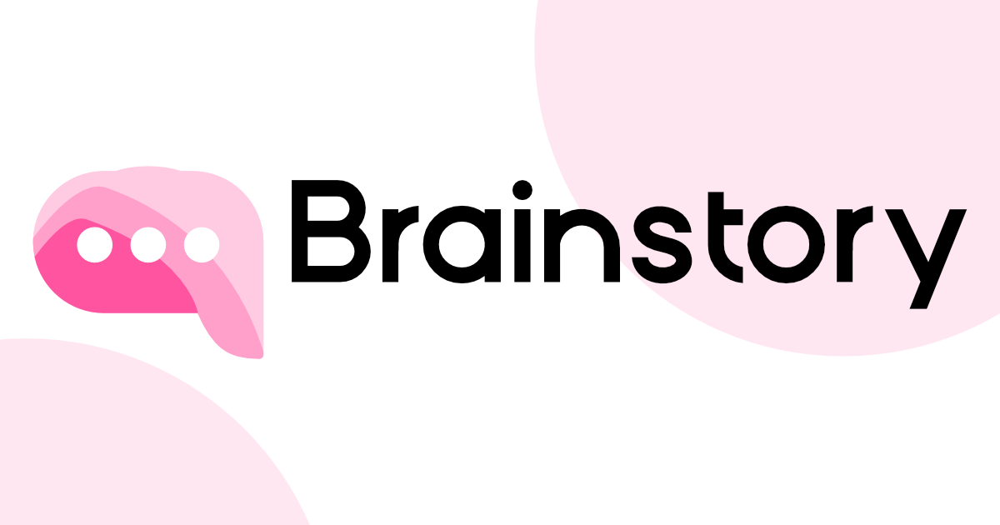
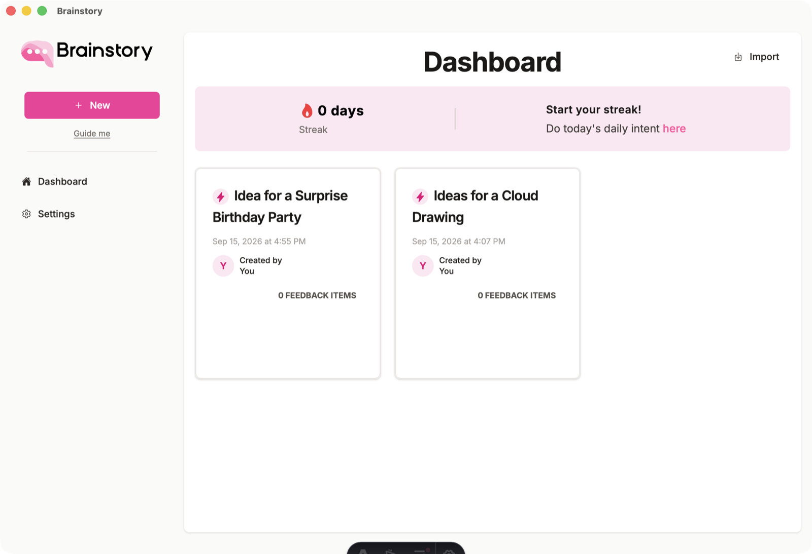

<div align="center">
  
  <p><strong>Think out loud — rebuilt as a local-first desktop app.</strong></p>
  <p>Everything (speech-to-text, the LLM, your ideas, streaks, settings) runs and lives<br/>
  on your machine. No accounts, no servers.</p>
  
</div>

## AI models

First launch (or from **Settings → AI Models**), download:

- **LLM** — Google Gemma 4 E2B (QAT 4-bit GGUF, ~3.3 GB, default), Gemma 4 E4B
  (QAT 4-bit, ~5.2 GB), or MiniCPM5 2B (~1.6 GB) for lighter machines.
  Runs via llama.cpp with Metal acceleration on Apple Silicon.
- **STT** — whisper.cpp tiny.en (~78 MB), base.en (~148 MB, default), small.en
  (~488 MB), or large-v3-turbo (~1.6 GB). On macOS 26+, the built-in Apple
  Speech engine (Speech.framework, on-device) is available instead — no model
  download at all, with a selectable language and whisper as the automatic
  fallback. New installs default to "Auto" (Apple Speech where available,
  whisper otherwise); upgraded installs keep whisper and can switch under
  Settings → AI Models. Apple Speech needs one-time permission under System
  Settings → Privacy & Security → Speech Recognition.

Downloads are verified against pinned file sizes and SHA-256 hashes before
being activated, so a truncated or corrupted transfer can't brick a model slot.
Downloads can be cancelled from the same card; a hard quit leaves no garbage
behind (partial `.part` files are swept at the next launch). Switching models
unloads the old engine only when the new one is ready to take over — if the
new model fails to load, the previous one is restored and the app keeps
working. Optionally paste a HuggingFace access token (Settings → AI Models) —
authenticated downloads are faster and never hit anonymous rate limits. The
token is stored locally and never sent back to the UI, only a `••••1234`
style hint.

Recording is captured as 16 kHz mono WAV in the webview and transcribed locally.

**External offload**: Settings → AI Models → External endpoints lets you point the LLM
and/or STT at any OpenAI-compatible server (Ollama, llama.cpp server, LM Studio, ...).
If an external STT URL is set it takes precedence over the local whisper model and
Apple Speech; likewise the LLM mode switch toggles local vs external.

## Sharing without accounts

Instead of the original share links, ideas travel as JSON files that you send however
you like (email, AirDrop, USB stick...):

- **Export** an idea (or feedback) from the idea page → `brainstory-*.json`
  containing the document, author name and a stable share id.
- **Import** from the dashboard → an idea lands in your library attributed to its
  author; feedback JSON attaches to the matching local idea, attributed to the
  sender and marked unread.
- Give feedback on any idea with **Give Feedback** (the normal feedback interview),
  then export the feedback and send it back.

The author name shown to others is your profile name (Settings → General).

## Daily reminders

Set a time under Settings → General → Notifications (or toggle it from the tray icon
menu). The app keeps running in the system tray when the window is closed and sends
a system notification once per day at the configured time. Quit fully from the tray
menu.

## Install

Grab the latest build for your OS from the [Releases page](https://github.com/brainstory/desktop-app/releases):

- **macOS** — download the `.dmg` (Apple Silicon only; there is no Intel build). Drag
  Brainstory to Applications and launch it from there.
- **Windows** — run the `Brainstory_*_x64-setup.exe` installer (NSIS).
- **Linux** — install the `.deb`, `.rpm`, or run the `.AppImage`.

**The builds are not code-signed.** On macOS the first launch shows "Brainstory can't
be opened because it is from an unidentified developer" — right-click (or Control-click)
the app and choose **Open**, then **Open** again in the dialog; from then on it launches
normally. On Windows SmartScreen shows "Windows protected your PC" — click
**More info**, then **Run anyway**. There are no developer accounts for signing
certificates, so this warning is expected on every first launch.

## Updates

Brainstory checks for updates on startup (at most once every 6 hours) against the
GitHub releases of this repository and installs them through Tauri's updater — the
download is verified against the release's signing key before anything is applied.
To opt out entirely, simply don't grant it network access with your firewall; the app
works fully offline after the models are downloaded. Update artifacts and their
checksums are attached to every release (`latest.json` + `SHA256SUMS.txt`).

## Where your data lives

Everything is local:

| What | Where |
| --- | --- |
| Ideas, drafts, daily logs | SQLite database at `~/Library/Application Support/ai.brainstory.desktop/brainstory.db` (macOS; `~/.local/share/...` on Linux, `%APPDATA%\...` on Windows) |
| Downloaded models | `.../ai.brainstory.desktop/models/` (multi-GB files) |
| HuggingFace token, external API keys | the macOS Keychain / system keyring (never in the database; a plaintext fallback row exists only where no keychain service is available) |
| Logs | rotating `brainstory.log` under the OS log dir |

To wipe everything, quit the app and delete the `ai.brainstory.desktop` folder (and
the keychain entries, via Keychain Access). A corrupted database is not deleted: on
next launch it is quarantined as `brainstory.db.corrupt-<timestamp>` next to the fresh
one, so your data is never silently discarded.

## Network access

The app is local-first, but it is not network-free. It contacts exactly:

- `huggingface.co` — model downloads (and only when you click Download).
- `github.com` — update checks on startup.
- Any **external AI endpoint you configure** yourself (Settings → AI Models).

Nothing else. There are no accounts, analytics, or telemetry servers — but "no
servers" here means *no Brainstory servers*, not "no network".

**Dark mode:** the window is pinned to a light theme (`"theme": "Light"` in
`tauri.conf.json`). This is deliberate for now — the accent palette is tuned for
light surfaces — and will change if/when dark variants of the tokens are designed.

## Manual model tests

Two integration tests need real model files and never run in CI's unit-test job (the
nightly workflow runs the engine smoke test with tiny downloaded models):

```sh
# whisper + llama coexisting in one process, with a tiny (~1 MB) test llama:
WHISPER_MODEL_PATH=/path/to/ggml-tiny.en.bin \
LLM_MODEL_PATH=/path/to/tiny.gguf \
cargo test --test engine_smoke

# prompt quality against a real model:
LLM_MODEL_PATH=/path/to/model.gguf cargo test --test model_prompts

# Apple Speech smoke test (macOS 26 host, terminal needs speech permission):
APPLE_STT_SMOKE=1 cargo test --test apple_stt_smoke
```

## Development

```sh
pnpm install          # installs the tauri CLI + frontend deps (workspace)

pnpm tauri:dev        # dev: astro dev server + debug build
pnpm tauri:build      # release build + .app + DMG (via scripts/make-dmg.sh,
                      # using plain hdiutil - tauri's own dmg bundler needs
                      # AppleScript control of Finder and fails headless)
pnpm -C app/frontend typecheck   # tsc --noEmit + astro check (strict)
pnpm -C app/frontend test        # vitest
pnpm -C app/frontend lint        # eslint
```

The frontend is TypeScript (`.ts` / `.tsx`; `.astro` pages stay `.astro`).
Keep `pnpm -C app/frontend typecheck` green alongside tests and lint.

Requirements: Rust, Node >= 24, pnpm, cmake (brew install cmake ninja), macOS 12+.
Building on macOS additionally uses the active Xcode's Swift toolchain; with an
Xcode 26 SDK the Apple Speech engine (macOS 26+) compiles in, and with an older
SDK it is stubbed out with a build warning (the app still runs, whisper handles
transcription). CI enforces the 26 SDK via `REQUIRE_MACOS26_SDK=1` so a stubbed
build can never ship. The env-gated Apple Speech smoke test runs with
`APPLE_STT_SMOKE=1 cargo test --test apple_stt_smoke` on a macOS 26 machine
(synthesizes audio via `say`, needs speech-recognition permission for the
terminal).

Local Windows cross-compile (no Windows machine needed):

```sh
brew install llvm lld makensis cmake ninja
rustup target add x86_64-pc-windows-msvc
cargo install cargo-xwin
./scripts/build-windows-local.sh   # -> .../bundle/nsis/Brainstory_*_x64-setup.exe
```

The binary is cross-compiled but never executed locally; runtime verification
happens via the nightly/release Windows CI builds.

## License

GPL-3.0-only — see [LICENSE](LICENSE). This covers the whole app: frontend,
Rust backend, and the prompts under `prompts/`.
